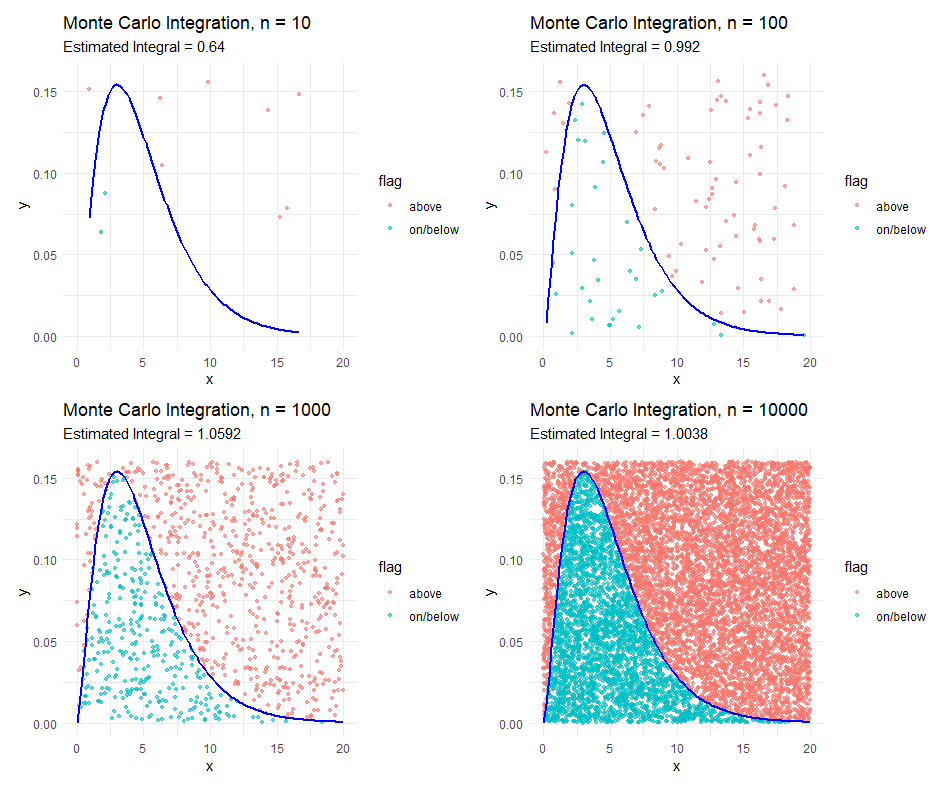

# Project Title

This project is intended to demonstrate how HW4.3 was completed.

## Overview

This repository contains all materials related to Homework 4.3 for STAT 184. The project demonstrates a complete data analysis workflow, including data collection, data wrangling, visualization, Monte Carlo simulation, and the use of generative AI tools.

The main deliverable is a fully reproducible Quarto document that integrates multiple analytical components into a structured PDF report.

### Interesting Insight (Optional)

A key insight from this project comes from the Monte Carlo numerical integration.

As the number of random samples increases, the estimate of the integral becomes more stable and converges toward the true value. This demonstrates the Law of Large Numbers in a visual and intuitive way.

This visualization highlights how increasing sample size reduces variability and improves accuracy.

## Data Sources and Acknowledgements

The following data sources were used in this project:

- **Airport Data**: Retrieved from a publicly accessible Wikipedia page  
  https://en.wikipedia.org/wiki/List_of_busiest_airports_by_passenger_traffic

- **Calcium Dataset**: Provided as part of STAT 184 course materials  
  Included in this repository as `calcium.csv`

## Current Plan

This project is currently focused on completing the HW4.3 requirements and producing a clean, reproducible report.

Future improvements may include:
- Enhancing visualizations for better presentation
- Extending Monte Carlo simulations to additional functions
- Adding more statistical analysis to the calcium dataset
- Improving automation and workflow efficiency

## Repo Structure

Stat184HW4.4/

│

├── hw4.4.qmd # Final Quarto report

├── README.md # Project documentation

│

├── images/ # Figures used in the report

│ ├── airport_plot.png

│ ├── airport_table.png

│ ├── mc_plot.png

│ ├── calcium_mean.png

│ ├── calcium_spaghetti.png

│ ├── calcium_box.png

│

├── calcium.csv # Dataset for calcium analysis

│

├── airport.R # Airport data processing

├── MonteCarlo.R # Monte Carlo simulation

├── MonteCarloExplain.txt # Explain how Monte Carlo used

├── calciumTest.R # Calcium data wrangling

├── hw4.4.pdf # the final output for hw4.3

## Authors

Qihaohan Zheng

E-mail: qjz5106@psu.edu