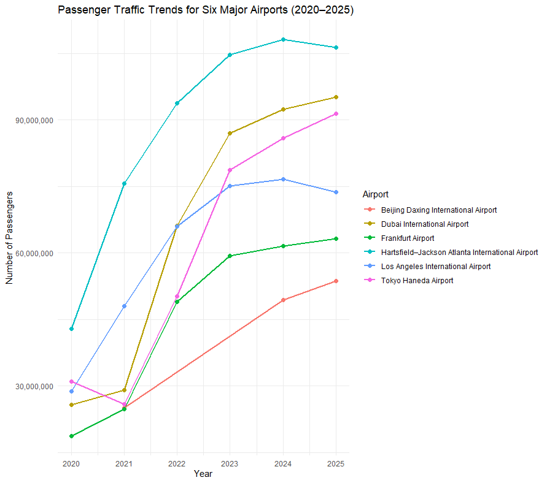
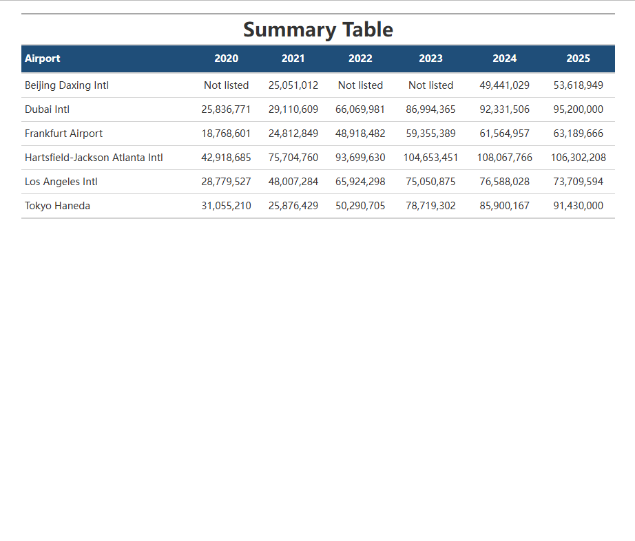
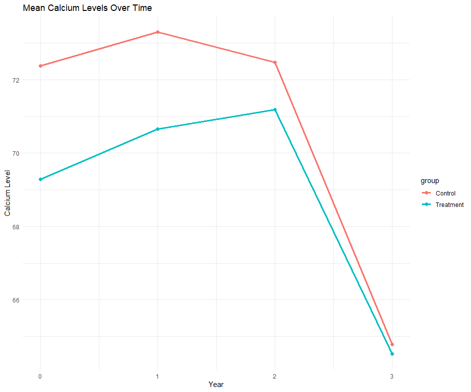
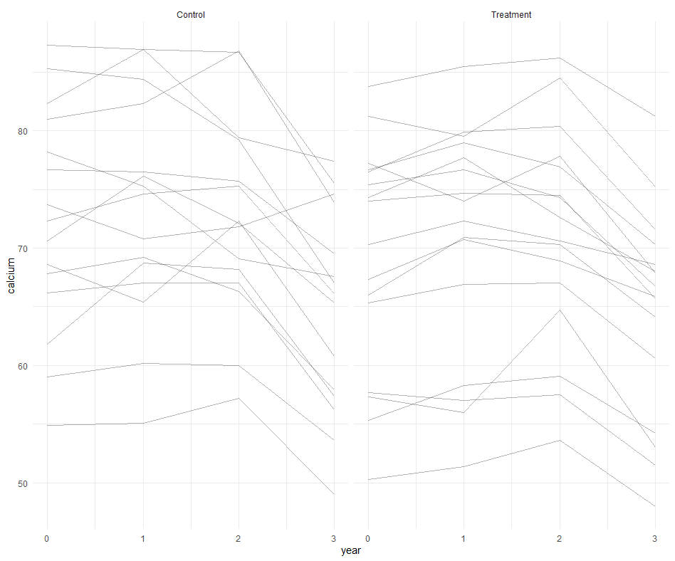
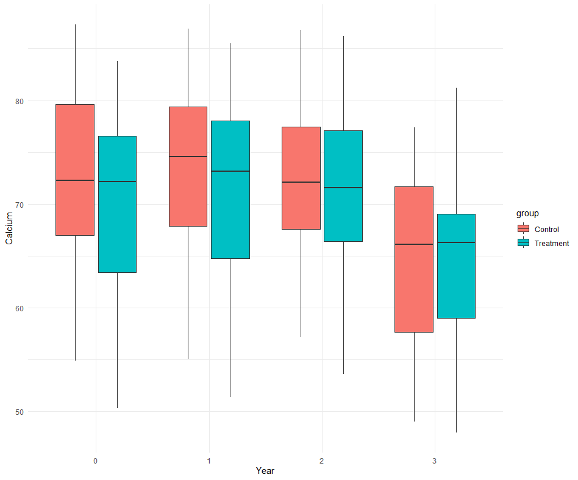

# 1. Busiest Airports Analysis

## Passenger Traffic Trends





The table and line graph together provide a comprehensive view of passenger traffic trends across six of the world’s busiest airports from 2020 to 2025. While the table allows for precise numerical comparisons, the graph highlights patterns and trajectories that are less immediately visible in tabular form.

A clear global recovery trend is evident beginning in 2022, following the significant decline in air travel during the COVID-19 pandemic. Airports such as Hartsfield–Jackson Atlanta International Airport and Dubai International Airport demonstrate particularly strong rebounds. Atlanta consistently maintains the highest passenger volume, exceeding 100 million passengers in peak years, reinforcing its role as a dominant global hub. Dubai shows one of the fastest growth rates, reflecting its importance as an international transit center connecting multiple regions.

Tokyo Haneda Airport presents a delayed but rapid recovery, likely due to stricter travel restrictions that were lifted later compared to other regions. In contrast, Frankfurt Airport shows a more gradual increase, suggesting a slower recovery in European air travel markets.

Los Angeles International Airport exhibits moderate growth followed by slight stabilization, indicating potential capacity or demand limits. Meanwhile, Beijing Daxing International Airport shows missing early data but a noticeable increase in later years, reflecting its relatively recent development and expansion.

Overall, the relationship between the table and the graph reveals three key insights:  
(1) a synchronized global recovery beginning around 2022,  
(2) regional differences in recovery speed and scale, and  
(3) the continued dominance of major international hubs in passenger traffic.

These patterns highlight how external factors such as global events, policy decisions, and infrastructure development influence air travel demand across different regions.

---

# 2. Monte Carlo Numerical Integration

## Small Multiple Visualization


The small multiple visualization demonstrates how Monte Carlo integration improves as the sample size increases. With a very small sample size (n = 10), the estimate is extremely unstable and can be far from the true value. As the number of samples increases to 100 and 1000, the approximation becomes more consistent, and the distribution of points begins to better reflect the shape of the function.

By the time the sample size reaches 10,000, the estimate stabilizes and closely approximates the true area under the curve. The visual density of points clearly outlines the region below the function, making it easier to distinguish between points that contribute to the estimate and those that do not.

From this visualization, we learn that Monte Carlo integration relies heavily on large sample sizes to produce accurate results. The variability seen in smaller samples highlights the randomness inherent in the method, while the convergence observed in larger samples demonstrates the Law of Large Numbers in action.

The exact value of the integral is approximately **1**. This conclusion is supported by the estimates observed in the larger sample plots (n = 1000 and n = 10000), which consistently approach values very close to 1. The increasing accuracy across the panels provides strong visual evidence that the method is converging to this true value.

---

# 3. Planning and Prompting GenAI Tools

## Data Context and Plan

The calcium dataset contains repeated measurements of calcium levels for two groups of participants over four years. The data is initially in a wide format, with separate columns representing time points for each group.

The goal is to restructure the data into a tidy format and create visualizations that allow for meaningful comparison between the control and treatment groups over time.

The plan includes reshaping the data into long format, creating variables for group and year, assigning subject identifiers, and generating visualizations such as line plots, individual trajectory plots, and boxplots to examine trends and variability.

---

## Plan-Based Prompt

“I have a dataset where the first four columns represent calcium measurements for a control group over four years, and the next four columns represent a treatment group. Convert this into tidy format with subject_id, year, group, and calcium level. Then create visualizations including a mean trend line plot, individual trajectories, and boxplots. Provide interpretation.”

---

## Results and Interpretation







The plan-based approach produced structured and meaningful results. The mean trend plot shows that both groups experience an increase in calcium levels from year 0 to year 2, followed by a decline in year 3. The treatment group appears slightly more stable across time.

The spaghetti plot reveals individual variability, showing that while general trends exist, participants respond differently over time. The treatment group shows somewhat tighter clustering, suggesting reduced variability.

The boxplots confirm these observations by illustrating overlapping distributions between groups, but with slightly narrower spreads for the treatment group in certain years.

---

## Generic Prompt Comparison

A generic prompt produced less precise results, with weaker data structuring and less targeted visualizations. The outputs lacked clear comparison between groups and did not fully leverage the structure of the dataset.

In contrast, the plan-based prompt resulted in more accurate transformations, more relevant visualizations, and deeper interpretation. This demonstrates that well-structured prompts significantly improve the quality of outputs generated by AI tools.

---

# 4. Reflection

Throughout this assignment, I developed a deeper understanding of how data structure, visualization, and computational methods interact to produce meaningful insights.

One key takeaway is the importance of data wrangling. The calcium dataset initially appeared difficult to interpret due to its wide format, but transforming it into a tidy structure made it possible to create effective visualizations and draw meaningful conclusions. This reinforced the idea that proper data preparation is essential for analysis.

Another important insight comes from the Monte Carlo simulation. By visualizing how estimates improve with larger sample sizes, I gained a clearer understanding of convergence and the Law of Large Numbers. Seeing the estimates approach the true value through simulation made the concept more intuitive than purely theoretical explanations.

The airport analysis highlighted how visualization can reveal patterns that are not immediately obvious in tables alone. Combining numerical summaries with graphical representations allowed for a more complete understanding of global trends in air travel.

Finally, working with generative AI tools demonstrated the importance of precise prompting. A well-structured, detailed prompt produced significantly better results than a vague one. This experience showed that effective use of AI requires careful planning and clear communication of goals.

Overall, this assignment helped me integrate data wrangling, visualization, statistical reasoning, and AI-assisted analysis into a cohesive workflow.

---

# Appendix

## A. Airport Code

```{r, echo=TRUE, eval=FALSE}
# airport.R
library(tidyverse)
library(rvest)

url <- "https://en.wikipedia.org/wiki/List_of_busiest_airports_by_passenger_traffic"
page <- read_html(url)

tables <- page %>%
  html_table(fill = TRUE)

airport_tables <- tables[1:6]
years <- 2025:2020

airport_data <- map2_dfr(airport_tables, years, ~{
  .x %>%
    rename_with(~ str_trim(.)) %>%
    rename_with(~ str_replace_all(., "\\[.*?\\]", "")) %>%
    select(contains("Airport"), contains("Passengers")) %>%
    rename(
      airport = 1,
      passengers = 2
    ) %>%
    mutate(
      year = .y,
      passengers = passengers %>%
        str_remove_all("\\[.*?\\]") %>%   
        str_remove_all(",") %>%           
        as.numeric()
    )
})

selected_airports <- c(
  "Hartsfield–Jackson Atlanta International Airport",
  "Frankfurt Airport",
  "Beijing Daxing International Airport",
  "Los Angeles International Airport",
  "Dubai International Airport",
  "Tokyo Haneda Airport"
)

airport_data_final <- airport_data %>%
  filter(airport %in% selected_airports) %>%
  select(airport, year, passengers) %>%
  arrange(airport, year)

airport_data_final


library(tidyverse)
library(knitr)

airport_table <- airport_data_final %>%
  mutate(
    passengers = format(passengers, big.mark = ",", scientific = FALSE)
  ) %>%
  arrange(desc(year), airport)

kable(
  airport_table,
  col.names = c("Airport", "Year", "Passengers"),
  caption = "Passenger Traffic for Six Major Airports, 2020-2025"
)

airport_data_final %>%
  ggplot(aes(x = year, y = passengers, color = airport)) +
  geom_line(size = 1) +
  geom_point(size = 2) +
  scale_y_continuous(labels = scales::comma) +
  labs(
    title = "Passenger Traffic Trends for Six Major Airports (2020–2025)",
    x = "Year",
    y = "Number of Passengers",
    color = "Airport"
  ) +
  theme_minimal()

install.packages("gt")
library(tidyverse)
library(gt)

selected_airports <- c(
  "Hartsfield–Jackson Atlanta International Airport",
  "Frankfurt Airport",
  "Beijing Daxing International Airport",
  "Los Angeles International Airport",
  "Dubai International Airport",
  "Tokyo Haneda Airport"
)

airport_order <- c(
  "Hartsfield–Jackson Atlanta International Airport",
  "Frankfurt Airport",
  "Beijing Daxing International Airport",
  "Los Angeles International Airport",
  "Dubai International Airport",
  "Tokyo Haneda Airport"
)

airport_labels <- c(
  "Hartsfield–Jackson Atlanta International Airport" = "Hartsfield-Jackson Atlanta Intl",
  "Frankfurt Airport" = "Frankfurt Airport",
  "Beijing Daxing International Airport" = "Beijing Daxing Intl",
  "Los Angeles International Airport" = "Los Angeles Intl",
  "Dubai International Airport" = "Dubai Intl",
  "Tokyo Haneda Airport" = "Tokyo Haneda"
)

summary_table <- airport_data_final %>%
  mutate(
    airport = recode(
      airport,
      "Hartsfield–Jackson Atlanta International Airport" = "Hartsfield-Jackson Atlanta Intl",
      "Frankfurt Airport" = "Frankfurt Airport",
      "Beijing Daxing International Airport" = "Beijing Daxing Intl",
      "Los Angeles International Airport" = "Los Angeles Intl",
      "Dubai International Airport" = "Dubai Intl",
      "Tokyo Haneda Airport" = "Tokyo Haneda"
    ),
    year = factor(year, levels = 2020:2025)
  ) %>%
  pivot_wider(
    names_from = year,
    values_from = passengers
  ) %>%
  select(airport, `2020`, `2021`, `2022`, `2023`, `2024`, `2025`)

summary_table %>%
  gt() %>%
  tab_header(
    title = "Summary Table"
  ) %>%
  fmt_number(
    columns = -airport,
    decimals = 0,
    sep_mark = ","
  ) %>%
  sub_missing(
    columns = everything(),
    missing_text = "Not listed"
  ) %>%
  cols_label(
    airport = "Airport"
  ) %>%
  tab_style(
    style = list(
      cell_fill(color = "#1f4e79"),
      cell_text(color = "white", weight = "bold")
    ),
    locations = cells_column_labels(everything())
  ) %>%
  tab_style(
    style = cell_text(weight = "bold", size = px(28)),
    locations = cells_title(groups = "title")
  ) %>%
  cols_align(
    align = "center",
    columns = -airport
  ) %>%
  cols_align(
    align = "left",
    columns = airport
  ) %>%
  tab_options(
    table.width = pct(95),
    data_row.padding = px(8),
    column_labels.padding = px(10),
    table.font.size = px(14)
  )
```

## B. MontrCarlo Code
```{r, echo=TRUE, eval=FALSE}
install.packages("patchwork")
library(tidyverse)
library(patchwork)

df_value <- 5
x_min <- 0
x_max <- 20
y_min <- 0
y_max <- 0.16
rectangle_area <- (x_max - x_min) * (y_max - y_min)
mc_simulation <- function(n, x_min, x_max, y_min, y_max) {
  data.frame(
    x = runif(n, min = x_min, max = x_max),
    y = runif(n, min = y_min, max = y_max)
  )
}
make_mc_plot <- function(n_value) {
  sim_data <- mc_simulation(
    n = n_value,
    x_min = x_min,
    x_max = x_max,
    y_min = y_min,
    y_max = y_max
  )
  
  sim_results <- sim_data %>%
    mutate(
      f_x = dchisq(x, df = df_value),
      flag = if_else(y <= f_x, "on/below", "above")
    )
  
  estimated_integral <- sim_results %>%
    summarize(
      p = mean(flag == "on/below"),
      estimate = p * rectangle_area
    ) %>%
    pull(estimate)
  
  ggplot(sim_results, aes(x = x, y = y, color = flag)) +
    geom_point(alpha = 0.6, size = 1) +
    stat_function(
      fun = dchisq,
      args = list(df = df_value),
      linewidth = 1,
      color = "blue",
      inherit.aes = FALSE,
      aes(x = x)
    ) +
    coord_cartesian(xlim = c(0, 20), ylim = c(0, 0.16)) +
    labs(
      title = paste("Monte Carlo Integration, n =", n_value),
      subtitle = paste("Estimated Integral =", round(estimated_integral, 4)),
      x = "x",
      y = "y",
      color = "flag"
    ) +
    theme_minimal()
}

plot10 <- make_mc_plot(10)
plot100 <- make_mc_plot(100)
plot1000 <- make_mc_plot(1000)
plot10000 <- make_mc_plot(10000)

plot10 + plot100 + plot1000 + plot10000
```

## C. Calcium Code
```{r, echo=TRUE, eval=FALSE}
library(tidyverse)

calcium <- read.csv("calcium.csv", header = TRUE)

calcium <- calcium %>%
  mutate(subject_id = row_number())

colnames(calcium) <- c(
  "control_0","control_1","control_2","control_3",
  "treat_0","treat_1","treat_2","treat_3",
  "subject_id"
)


calcium_long <- calcium %>%
  pivot_longer(
    cols = -subject_id,
    names_to = c("group","year"),
    names_sep = "_",
    values_to = "calcium"
  ) %>%
  mutate(
    group = if_else(group == "control", "Control", "Treatment"),
    year = as.numeric(year)
  )

calcium_long %>%
  group_by(group, year) %>%
  summarise(mean_calcium = mean(calcium, na.rm = TRUE)) %>%
  ggplot(aes(x = year, y = mean_calcium, color = group)) +
  geom_line(size = 1.2) +
  geom_point(size = 2) +
  labs(
    title = "Mean Calcium Levels Over Time",
    x = "Year",
    y = "Calcium Level"
  ) +
  theme_minimal()

ggplot(calcium_long, aes(x = year, y = calcium, group = subject_id)) +
  geom_line(alpha = 0.3) +
  facet_wrap(~group) +
  theme_minimal()

ggplot(calcium_long, aes(x = factor(year), y = calcium, fill = group)) +
  geom_boxplot() +
  labs(x = "Year", y = "Calcium") +
  theme_minimal()
```
